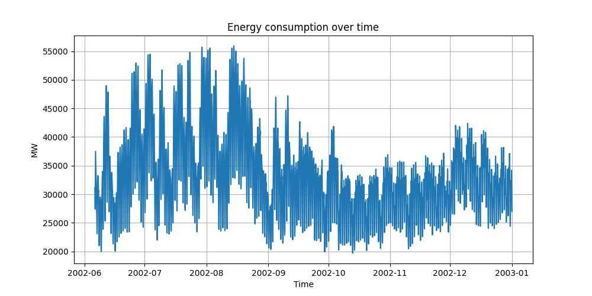
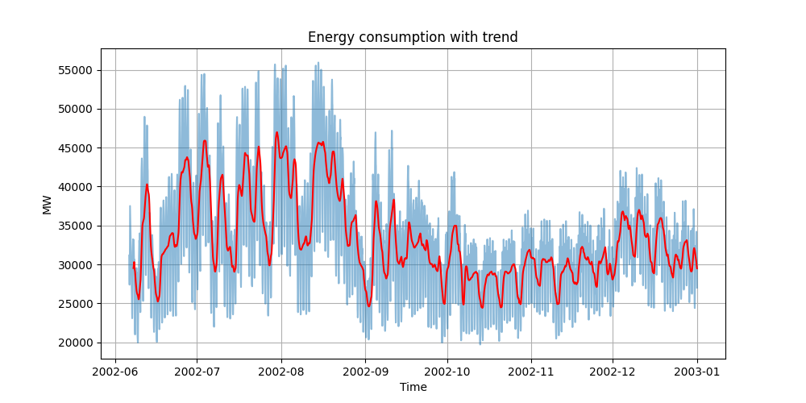

# Energy Consumption Analysis (Python)

## Overview

This project analyzes real-world electricity consumption data to identify patterns, trends, and extreme values over time.

The dataset contains hourly energy usage (in MW), which allows for time series analysis and exploration of consumption behavior across different periods.

The main objective is to transform raw data into meaningful insights that could support decision-making in energy management and forecasting.

---

## Objectives

- Analyze energy consumption over time
- Identify trends and seasonal patterns
- Detect peak (maximum) and low (minimum) demand periods
- Provide a clear and interpretable visualization of the data

---

## Dataset

- Source: PJM Interconnection (Energy Market Data)
- Frequency: Hourly
- Variable analyzed: `PJME_MW` (Megawatts consumption)

---

## Technologies Used

- Python
- Pandas (data manipulation and analysis)
- Matplotlib (data visualization)

---

## Data Processing

The following steps were performed:

1. Load CSV data using pandas
2. Convert datetime column to proper format
3. Sort data chronologically
4. Limit dataset size for faster analysis
5. Calculate key statistics:
   - Average consumption
   - Maximum consumption
   - Minimum consumption
6. Extract timestamps of extreme values
7. Apply rolling average (24-hour window) to smooth fluctuations

---

## Results

### Key Metrics

- Average consumption: ~33,143 MW  
- Maximum consumption: 55,934 MW  
- Minimum consumption: 19,702 MW  

These values highlight significant variability in energy demand over time.

---

## Visualizations

### Raw Consumption Data



This chart shows the hourly energy consumption, revealing high variability and short-term fluctuations.

---

### Trend Analysis (Rolling Average)



The red line represents a 24-hour rolling average, which helps identify underlying trends:

- Higher consumption during summer months
- Lower demand in later periods
- Clear cyclical behavior in energy usage

---

## Business Insights

This type of analysis can be useful for:

- Identifying peak demand periods
- Improving energy distribution planning
- Supporting demand forecasting models
- Detecting anomalies or unusual consumption patterns

---

## How to Run

1. Install dependencies:

```bash
pip install -r requirements.txt
```
2. Run the program:

python main.py

## Learning Outcomes

Through this project, I practiced:

- Working with time series data
- Using pandas for real-world data analysis
- Data visualization with matplotlib
- Extracting actionable insights from raw datasets
- Structuring a data analysis project end-to-end

## Future Improvements

- Add forecasting models (e.g. ARIMA, Prophet)
- Analyze daily and weekly patterns
- Detect anomalies automatically
- Integrate SQL for larger datasets
- Build an interactive dashboard (e.g. Power BI or Streamlit)

## Author

Judit Piqué Venteo
Mathematics Student | Data Analysis | Python